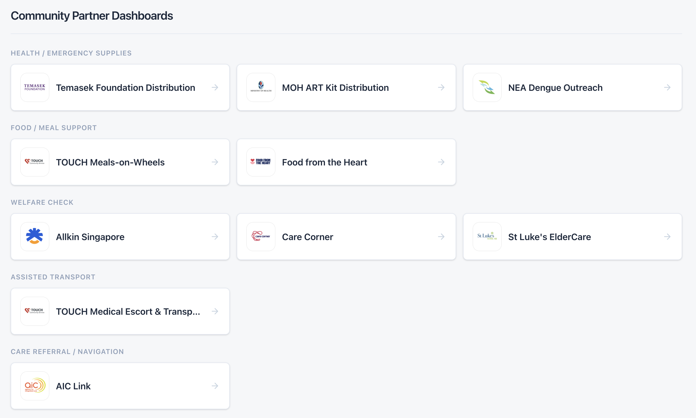
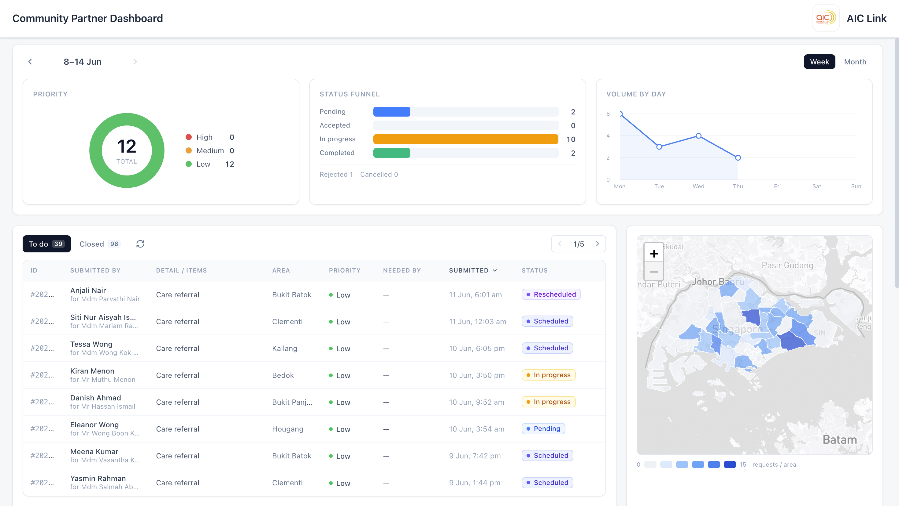
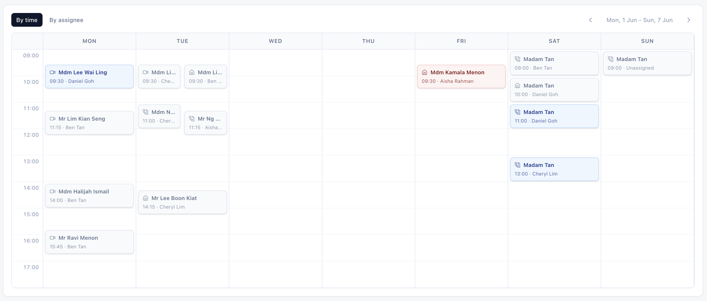
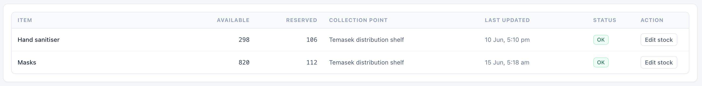

<p align="center">
  
</p>

# ORCA Community Partner Dashboard

> An operations room that turns caregiver requests into coordinated community response.

**ORCA** stands for **Outreach, Resource & Caregiver Assistance**.

---

## The problem

When caregivers ask for help — medication collection, groceries, a welfare check, transport — those
requests scatter across phone calls, messages, and spreadsheets. The partner organisations that can
actually help have no shared, real-time picture of who needs what, who's free, and what's already in
motion. During an emergency, that friction costs time no one has.

## How ORCA solves it

The Community Partner Dashboard is the **operations room** for community responders. Caregiver
requests arrive as a live, prioritised queue scoped to each partner organisation, and coordinators
triage, assign, schedule, and fulfil them — all in one place, built for speed under pressure.

- **Live request queue** — incoming caregiver requests, sorted by urgency, scoped to your
  organisation.
- **One-glance triage** — status and priority are legible at a glance; the next action is always one
  click away.
- **Drag-to-schedule** — a working-hours schedule board (Singapore time) with conflict detection.
- **Fulfilment tracking** — checkpoint-by-checkpoint progress for supplies and meal routes.
- **Inventory at a glance** — stock levels with clear OK / Low / Out signals.
- **Smart rerouting** — if one partner can't take a request, it automatically reroutes to a fallback
  organisation.
- **Map view** — a heatmap of requests by Singapore planning area.
- **Demo partner workspaces** — includes 10 demo dashboards across 5 support types: health /
  emergency supplies, food / meal support, welfare checks, assisted transport, and care referral /
  navigation.
- **Privacy by design** — area-level location only; minimum necessary information, always.

The partner names and logos are used only to make the demo workflow realistic; this prototype is not
an official deployment or partnership with those organisations.

## Features

### Demo partner workspaces

Choose from 10 demo partner dashboards across 5 support types:

- Health / emergency supplies
- Food / meal support
- Welfare checks
- Assisted transport
- Care referral / navigation



### Operations overview

Track request volume, urgency, fulfilment status, queue activity, and area-level demand in one
operations view.



### Scheduling

Assign work by time or assignee, spot conflicts, and keep fulfilment work inside a shared schedule.



### Inventory

Monitor available and reserved stock so partners commit only what they can actually fulfil.



## How it all connects

ORCA has three surfaces that stay in sync in **real time**:

```
 ┌──────────────────────┐   publishes    ┌──────────────────────┐   sends help    ┌──────────────────────┐
 │ ORCA Authority       │   advisory ─►   │ ORCA Caregiver       │   request ─►    │ ORCA Community       │
 │ Dashboard            │                 │ Web App              │                 │ Partner Dashboard    │
 │ · health officers    │                 │ · caregivers         │                 │ · partner orgs ◄HERE │
 └──────────────────────┘                 └──────────────────────┘                 └──────────┬───────────┘
                                                    ▲                                         │
                                                    └───────── fulfilment status ◄────────────┘
```

From the responder's seat:

1. A caregiver submits a help request in the **Caregiver Web App**.
2. The request **arrives** in this dashboard, routed to the right partner and prioritised by urgency.
3. The coordinator **accepts, assigns, and schedules** it.
4. The team fulfils it, advancing it through fulfilment checkpoints.
5. Each update **syncs back** to the caregiver in real time — closing the loop.

## Related repositories

- [ORCA Caregiver Web App](https://github.com/kjcheong03/orca)
- [ORCA Authority Dashboard](https://github.com/kjcheong03/authority-dashboard)

## Tech stack

- **Next.js 16** (App Router) · **React 19** · **TypeScript**
- **Tailwind CSS v4** · **lucide-react** · **clsx** + **tailwind-merge**
- **Next.js Server Actions** for the request / schedule / inventory workflow
- **Leaflet** + **geojson-vt** for the planning-area heatmap
- **Recharts** + hand-built SVG for analytics

## APIs & data sources

| Service | Used for | Details |
|---|---|---|
| Mapbox | Operations map + planning-area heatmap basemap (`light-v11`) | token · falls back to OpenStreetMap |
| OpenStreetMap | Default map tiles | no key |
| Singapore planning-area GeoJSON | Heatmap regions | bundled |

## Getting started

```bash
npm install
npm run dev                    # http://localhost:3000
```

> Optional: set `NEXT_PUBLIC_MAPBOX_TOKEN` for Mapbox basemaps (otherwise OpenStreetMap is used).

---

<p align="center">
  Built for a hackathon by <strong>acacia tembusu dining hall</strong> 🌳
</p>
